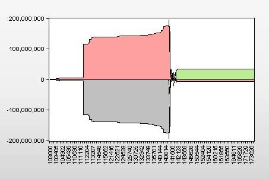

# order-book-plots

Amazon Lightsail server: http://3.223.119.154:3838/

--- Most of my code is currently here: ---

https://github.com/leonid-tkach/order-book-plot-find

## What is an order-book plot?

Order-book plots are about stock market. They are a closely related bunch of orders and trades.

## How do these OB plots look like?

Like this. Red dots are buy orders, dark blue ones in the end of it are trades.

Or this. These dark green dots are sale orders.

## Why did I name them "plots"?

As you see in the *plots* above, they seem to be more than just plots (figures). The price dynamic tells us some drama, some *plot* behind it. So order-book plots are both, pictures and stories.

I have tried to give an idea of it in this very short presentation: https://docs.google.com/presentation/d/1i27WkaikonMWRYUc3aiEB2DqW2aQznqykuqXclO93ko/edit?usp=sharing

Here is more technical illustration:

## Why are OB-plots important?

Just look how much a big OB-plot can take from the trading day as a whole:

OB-plot 1|OB-plot 2
---|---
|
|
|

## Some statistical characteristics of the plots

If we split ob-plots on ten groups by volume of *an ob-plot*, group volume shows that the smallest ob-plots give collectively  most of the trade day volume, not the biggest ones in the pictures above.

The illustrations above are from my Master’s thesis of 2013. I am in the process of making some instruments to make such things interactively. All code is new. I used C++ for searching plots and Eviews for illustrations then. I also didn't know anything about algorithms.

Here is one of them:

## 3D presentation of all OB-plots of a trading day.

I tried to use K-means to split ob-plots into groups.

I only excluded OB-plots without any trades. Every dot is an ob-plot. 

Here is the link to my R-Shiny app. 

http://3.223.119.154:3838/order-book-plots/

There is only this there for now.

- OBPTDVOLRATIO - ob-plot volume / trade day buy/sell volume during ob-plot

- BUYSELLYIELD - difference between buy end sell trade yield in a ob-plot

- MINMAX - max(TRADEPRICE) - min(TRADEPRICE) during an ob-plot.

I am not sure if the result is good. I may become more clear in trade day dynamics pictures similar to the ones we just saw.

## Algorithms and code

https://github.com/leonid-tkach/order-book-plot-find

I use the algorithm for searching connected components from this book: https://algs4.cs.princeton.edu/41graph/

See this j-notebook: http://localhost:8888/notebooks/Documents/GWU/final_project/order-book-plot-find/OrderBookPlots.ipynb

All other ipynb-files in the repository use this one.